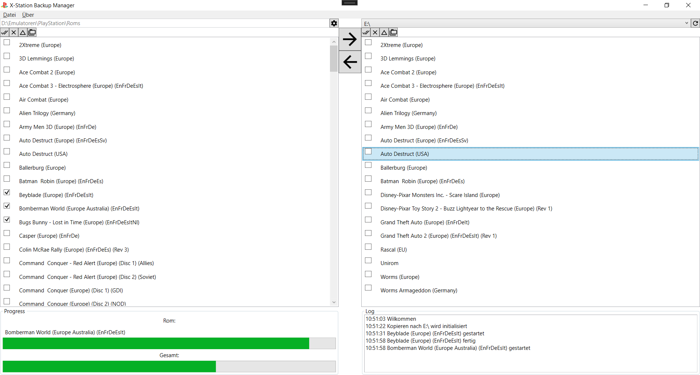

# xStationBackupManager
X-Station Backup Manager is a simple tool to manage your PS1 roms im combination with an X-Station ODE.

This is currently an alpha version. There is no build, you have do this on your own. And you have to set your roms path in code.
Open "OptionsManager.cs" and replace that path. Beside of that, there is no translation, it is only available in german at this moment.
The complete functionality is to copy roms which were packed as 7z, to an sd card. More features will be available soon.

This software is licensed under the GPL v3