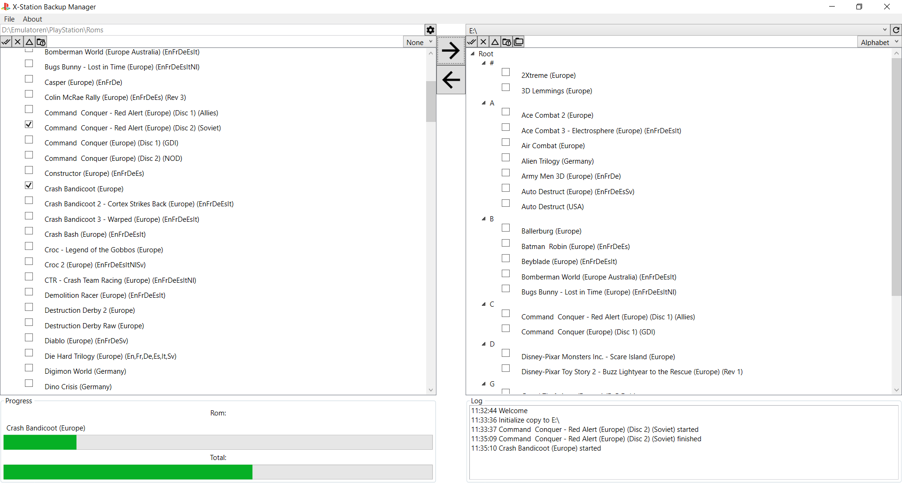

# xStationBackupManager
X-Station Backup Manager is a simple tool to manage your PS1 roms im combination with an X-Station ODE.

Functions:
- Copy roms to your sd card
- Select only new/missing roms
- Reorganize your sd card (One list/Alphabet)
- Fix folder problems (folder in folder with same name)

It supports extracting your roms from an archive direct on your sd-card. Supported archives:
- .7z
- .zip
- .bzip2
- .gzip
- .tar"
- .rar

Supported rom formats:
- .bin/.cue
- .iso

Languages:
- Deutsch
- English

This software is licensed under the GPL v3